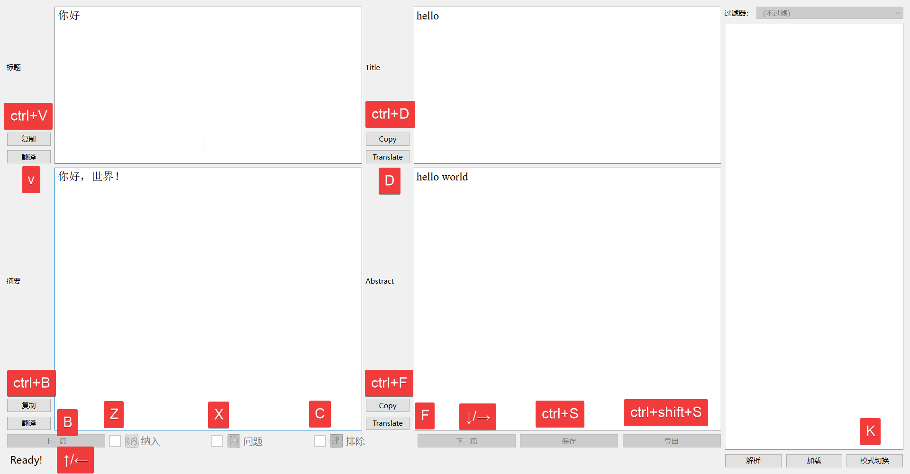

# 欢迎来到本仓库！

## 本项目用于优化繁杂的文献筛选工作，适合需要大量筛选文献的同学使用

### 使用PyQt6制作，python版本3.9.10

### 所需的的第三方库在requirements.txt中有写

### 运行的主程序为[main_window.py](https://github.com/hui2109/ScreenRefsViaEndnote/blob/main/main_window.py)

### 注意事项：

1. 尽量不使用ctrl+A快捷键，使用ctrl/shift+鼠标点击进行多选
2. 软件运行过程中，不能使用代理
3. 翻译英文文章时，尽量点慢一点，太快会导致软件崩溃

### 快捷键如下图

